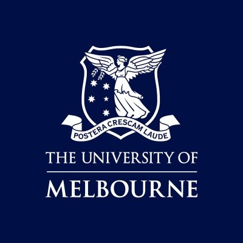

# Rocket Tracking System

 
2024 Electrical Engineering Capstone Project.
#### Authors:
* Dani Azeez
* Booshana Manikkuwadu
* Gunjeet Singh
#### Project Supervisors:
* Prof Len Sciacca (Main)
* Dr Khusro Saleem (External Supervisor)
#### Electrical Engineering Coordinator:
A/Prof Marcus Brazil

## Set Up

## Relevant Documentation
* Read the SoapySDR Documentation found here: https://pothosware.github.io/SoapySDR/doxygen/latest/classSoapySDR_1_1Device.html
* Sample code for the SDR implementation can be found here: https://github.com/pothosware/SoapySDR/wiki/PythonSupport

## Relevant Information
* Here is some relevant information regarding Quadruture Sampling: https://pysdr.org/content/sampling.html